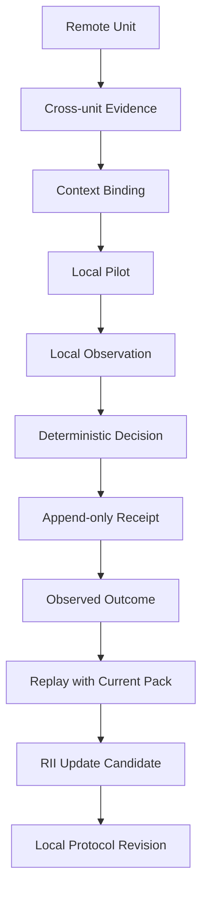

# LoPAS Distributed Learning

**Local learning. Asynchronous sharing. No forced global convergence.**

`lopas-distributed-learning` is an experimental protocol for sharing learned decision structures across independent units without forcing those units to share the same model, context, thresholds, or conclusions.

A unit may be a region, organization, team, community, agent, device, or local AI system.

Each unit learns from **its own outcomes**.

Other units can share mature protocols, receipts, failures, and context — but imported evidence does **not** directly rewrite local decision boundaries.

Instead:

> Remote knowledge changes local questions before it changes local rules.

This repository is a working PoC built around **LoPAS RII (Reverse Inference Index)**, deterministic routing, append-only receipts, replay, context binding, and protocol lineage.

---

## Why

Most distributed learning systems ask:

> How do we synchronize the model?

This project asks a different question:

> How can independent systems learn locally, exchange what they discovered, and remain different?

The goal is not global synchronization.

The goal is **eventual resonance**.

```text
Unit A
  observe
    ↓
  decide
    ↓
  outcome
    ↓
  learn locally
    ↓
  mature protocol
    ↓
       asynchronous sharing
                ↓
             Unit B
          context binding
                ↓
              pilot
                ↓
          local outcome
                ↓
          local learning
                ↓
          local protocol fork
                ↓
              re-share
```

A protocol that worked in one environment is not assumed to work elsewhere.

It becomes a **candidate for local re-testing**.

---

## Core idea

### 1. Learning stays local

RII is treated as a local learning mechanism.

A unit can update its learning evidence from its **own observed outcomes**.

```text
Local Observation
      ↓
Decision
      ↓
Outcome
      ↓
Replay
      ↓
RII Update Candidate
      ↓
Human / policy review
      ↓
Optional local boundary revision
```

Imported success does not increase local RII.

Imported failure does not prove that a local boundary is wrong.

---

### 2. Sharing does not mean copying

Remote evidence enters the system as `cross_unit_evidence`.

```text
Remote Protocol + Outcome
          ↓
Cross-unit Evidence
          ↓
Context Binding
          ↓
PILOT / OBSERVE_MORE
          ↓
Local Outcome
          ↓
Local RII
```

The imported protocol can be:

- adopted as a local pilot
- transformed
- partially reused
- rejected
- retained as unknown
- forked into a new local protocol

There is no requirement to merge back into a global master.

---

### 3. Context travels with the protocol

A protocol without context is dangerous.

Imported evidence can retain:

- `origin_unit`
- `local_unit`
- `protocol_ref`
- source context
- local context
- context similarity
- unresolved local variables
- source receipt
- parent protocol
- Git commit / lineage information

Example:

```yaml
kind: cross_unit_evidence

source_unit: region-a
local_unit: region-b

protocol_ref: protocol-x@a1

source_outcome:
  decision_was: correct

context_binding:
  similarity: 0.62

  imported_context:
    environment: "region-a"
    constraints:
      - "constraint-a"
      - "constraint-b"

  local_context:
    environment: "region-b"

  local_unknowns:
    - "unknown-variable-1"
    - "unknown-variable-2"

transferability:
  status: remote_only
  local_verdict: PILOT
  local_outcome_ref: null
  updates_local_rii: false
```

A high similarity score is **not** permission to auto-adopt the protocol.

Local evidence is still required.

---

## RII learning bridge

The current PoC maps outcome and replay evidence into the four RII components.

### HCD — Hidden Cause Detection

What hidden condition may explain the outcome?

### BFR — Boundary Failure Recognition

Which decision boundary may have failed?

### BU — Boundary Update

What boundary change should be considered?

### OR — Outcome Reinterpretation

How should the original result be reinterpreted after seeing reality?

The system generates an **RII update candidate**.

It does not automatically rewrite the decision system.

```yaml
aggregate_rii_score_update: null

BU:
  automatic_apply: false
```

---

## Safety invariant

The most important rule in v0.3:

```text
imported evidence
    =>
boundary_update_eligible == false
```

Remote knowledge may trigger:

```text
PILOT
OBSERVE_MORE
HOLD
```

but never direct local boundary mutation.

For local evidence:

```text
local known outcome
    =>
boundary update MAY become eligible
    =>
automatic_apply == false
```

So even local learning creates a **candidate**, not an uncontrolled self-modification.

---

## Outcome classes

The current prototype uses four outcome classes.

| Outcome | Meaning |
|---|---|
| `correct` | The previous decision was supported by the observed outcome |
| `premature` | The system closed or routed too early |
| `missed` | A relevant branch, candidate, condition, or route was missing |
| `unknown` | Available evidence is still insufficient |

`unknown` is not treated as failure.

It is retained for future observation.

---

## Local RII behavior

| Evidence | Outcome | Replay | Candidate behavior |
|---|---|---|---|
| local | `correct` | same | preserve boundary |
| local | `correct` | changed | review possible regression |
| local | `premature` | same/changed | review tighter boundary |
| local | `missed` | same/changed | review missing branch/candidate/gate |
| local | `unknown` | any | retain unknown, observe more |
| imported | `correct` | n/a | `pilot_locally` |
| imported | `premature` | n/a | retain as negative transfer evidence |
| imported | `missed` | n/a | retain as negative transfer evidence |
| imported | `unknown` | n/a | imported unknown retention |

A newer rule is not automatically considered better.

If a previously `correct` historical decision changes under the current router, the system flags a possible **regression** for review.

---

## Architecture



The two learning paths remain separate:

```text
LOCAL

Observation
→ Decision
→ Outcome
→ Replay
→ Local RII


DISTRIBUTED

Remote Protocol
→ Cross-unit Evidence
→ Context Binding
→ Local Pilot
→ Local Outcome
→ Local RII
```

---

## Why deterministic routing?

The current PoC uses a deterministic LoPAS Coordinate Router.

For the same domain pack and answer set, the router should produce the same decision.

This makes it possible to compare:

```text
then
vs
now
```

without confusing model randomness with rule evolution.

Current router-side indicators include:

- `DoQ-R`
- `RDI-R`
- `BCDI-R`
- `SCI-R`

These are operational Router indicators and are treated separately from LoPAS Semantic `-S` indicators.

---

## Receipts

Decision history is stored as append-only receipts.

A receipt can preserve:

- observation
- decision
- framework
- domain
- answers
- outcome
- provenance
- lineage
- prior hash
- replay result
- RII update candidate
- cross-unit evidence

This allows the system to ask:

> What did this unit believe at that time?

rather than only:

> What does the current version believe now?

---

## Git as protocol lineage

Git is not only source control in this design.

It can become part of the learning lineage.

```text
protocol v0.1
    ↓
local outcome
    ↓
RII candidate
    ↓
boundary revision
    ↓
commit
    ↓
protocol v0.2
```

Another unit can fork it:

```text
region-a/protocol-x
        │
        ├── region-b fork
        │       ↓
        │   local outcome
        │       ↓
        │   region-b revision
        │
        └── region-c fork
                ↓
            transformed version
```

No branch is required to become globally canonical.

A later unit can compare lineage and selectively reuse only the structures that resonate with its own environment.

---

## Quick start

### Install

```bash
npm install
```

### Run tests

```bash
npm test
```

### Run router demo

```bash
npx tsx demo.ts
```

---

## CLI

### Record a deterministic local decision

```bash
npx tsx src/cli.ts route \
  it_support \
  q_error_type=auth_error \
  q_internal_network_login=works_internally
```

---

### Add the real-world outcome

```bash
npx tsx src/cli.ts outcome \
  <receipt-id> \
  correct \
  "authentication route resolved the incident"
```

Outcome values:

```text
correct
premature
missed
unknown
```

---

### Replay historical decisions

Run old observations against the current domain pack:

```bash
npx tsx src/cli.ts replay it_support
```

Possible result:

```text
= receipt-a: route
≠ receipt-b: route → ask
```

A changed decision is evidence for review — not automatic proof of improvement.

---

### Generate RII update candidates

Preview:

```bash
npx tsx src/cli.ts rii it_support
```

Append candidates to the receipt log:

```bash
npx tsx src/cli.ts rii it_support --append
```

---

### Import evidence from another unit

```bash
npx tsx src/cli.ts import-evidence \
  docs/imported-evidence.example.yaml
```

This creates `cross_unit_evidence`.

It does **not** update local RII.

---

### Run a local pilot from imported evidence

```bash
npx tsx src/cli.ts pilot-import \
  <cross-unit-evidence-id> \
  it_support \
  q_error_type=auth_error \
  q_internal_network_login=works_internally
```

The resulting local receipt retains lineage back to the imported evidence.

After a local outcome is observed, the unit may generate its own local RII candidate.

---

### Inspect receipts

```bash
npx tsx src/cli.ts list
```

---

### Verify the receipt chain

```bash
npx tsx src/cli.ts verify
```

---

## Current repository structure

```text
.
├── src/
│   ├── cli.ts
│   ├── engine/
│   │   ├── core.ts
│   │   ├── receipt.ts
│   │   ├── rii.ts
│   │   └── session.ts
│   └── data/
│       └── diagnosis_types/
│           └── it_support/
│               ├── manifest.yaml
│               ├── questions.yaml
│               ├── axes.yaml
│               └── candidate_regions.yaml
│
├── receipts/
│   └── log.yaml
│
├── tests/
│   ├── router.test.ts
│   ├── receipt.test.ts
│   └── rii.test.ts
│
├── docs/
│   ├── distributed-rii-v0.3.md
│   ├── imported-evidence.example.yaml
│   ├── rii-imported-candidate.example.yaml
│   └── rii-update-candidate.example.yaml
│
├── patches/
│   └── v0.2-to-v0.3.patch
│
├── demo.ts
└── package.json
```

---

## Design principles

### Local first

Every unit must remain useful without a network connection.

```text
observe
→ decide
→ act
→ observe outcome
→ learn
```

should work locally.

---

### Asynchronous by default

Units do not need real-time synchronization.

A protocol may travel minutes, days, months, or years after it was created.

Delay is not necessarily failure.

It may represent **local maturation time**.

---

### No global model required

Different units may maintain:

- different thresholds
- different protocol forks
- different evidence
- different contexts
- different conclusions

The network does not need to converge on one global state.

---

### Share evidence, not authority

A remote unit can say:

> This worked here, under these conditions.

It cannot say:

> Therefore your boundary must change.

---

### Preserve uncertainty

Unknown evidence remains unknown until more evidence appears.

The protocol should make uncertainty transportable instead of forcing premature classification.

---

### Fork before merge

Local transformation is expected.

A transferred protocol may become:

```text
X
↓
X-B
↓
X-B2
```

without being considered a broken copy of `X`.

Variation is part of the learning process.

---

## Eventual resonance

Traditional eventual consistency assumes distributed nodes eventually converge toward the same state.

This project does not require that.

Instead, it explores **eventual resonance**:

> Independent units remain locally autonomous, but structures that prove useful across different environments can be rediscovered, adapted, and propagated.

The shared object is not a global truth.

It is a **traceable structure with evidence**.

```text
local variation
      +
local selection
      +
asynchronous exchange
      +
lineage
      =
distributed protocol evolution
```

---

## Possible applications

The protocol is domain-agnostic in principle.

Potential units include:

- local governments
- regional infrastructure operators
- disaster-response teams
- organizations
- factories
- research groups
- AI agents
- local-first software
- offline / intermittent networks
- community knowledge systems
- distributed simulation environments

The current implementation is only a small deterministic PoC.

---

## What this project is not

This project is **not**:

- federated model training
- automatic global consensus
- a blockchain
- a centralized policy server
- autonomous self-modifying AI
- proof that RII is a scientifically validated cognitive metric

It is currently an experimental protocol and implementation for exploring **auditable local learning and cross-unit knowledge transfer**.

---

## Current status

**v0.3 — Distributed RII**

Implemented:

- deterministic local routing
- append-only decision receipts
- outcomes
- historical replay
- RII update candidates
- local/imported evidence separation
- Context Binding
- cross-unit evidence
- local pilots from imported protocols
- protocol/evidence lineage
- canonical evidence IDs
- receipt hash-chain verification
- explicit prevention of automatic imported boundary updates

---

## Next directions

Possible next steps:

### v0.4 — Resonance aggregation

Track the same protocol lineage across multiple independent units without turning cross-unit success into a global truth score.

```text
A success
B success
C transformed success
D rejected
```

becomes transferability evidence rather than forced consensus.

### v0.5 — Protocol promotion

Define when repeated local validation is strong enough to publish a protocol as a mature reusable candidate.

### v0.6 — Offline exchange

Package protocol + context + receipts into portable bundles that can be exchanged over delayed or intermittent networks.

### v0.7 — Git-native lineage

Bind protocol versions and learning receipts directly to commits, tags, forks, and release artifacts.

---

## Minimal philosophy

```text
Do not synchronize conclusions.
Synchronize the ability to inspect how conclusions were learned.
```

And:

```text
A successful protocol from another place
is not an answer.

It is a better question
for this place.
```

---

## Related LoPAS concepts

This repository currently connects:

- **RII** — Reverse Inference Index
- **DDA** — Deliberative Decision Architecture
- **HOLD / REFRAME / REJECT / OBSERVE_MORE / PILOT / EXECUTE**
- **Unknown Retention**
- **Decision Receipts**
- **Replay**
- **Protocol Lineage**
- **Context Binding**
- **Cross-unit Resonance**

The broader goal is to explore a system in which independent units can mature locally and still participate in a larger learning network without losing their own context.

---

**LoPAS Distributed Learning**

_Local autonomy, shared evidence, asynchronous resonance._
