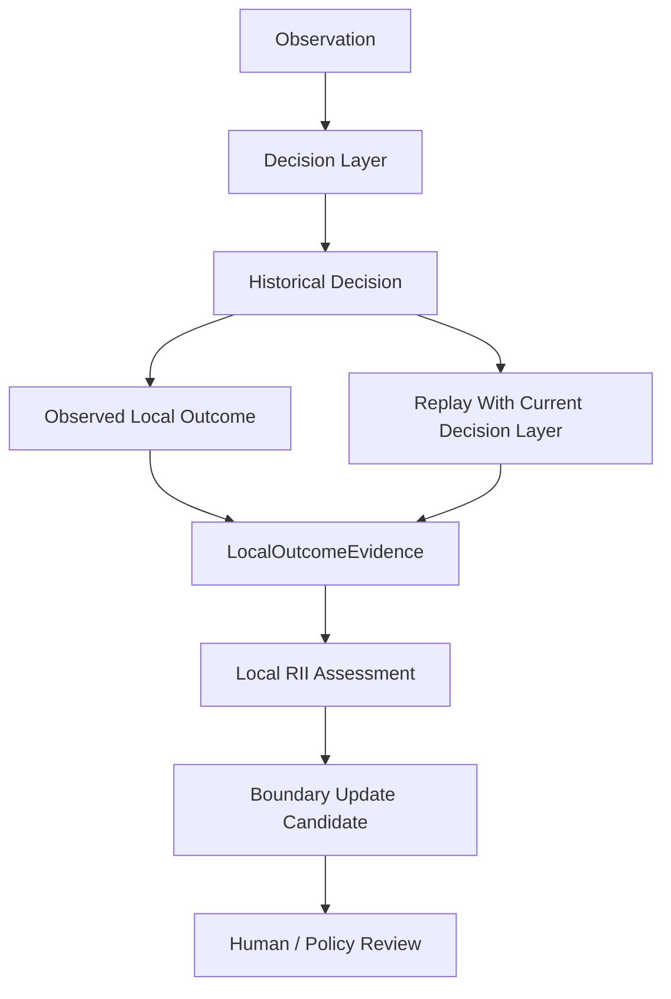

# Architecture

## Purpose

`lopas-distributed-learning` separates **decision-making** from **learning from decisions**.

The core does not require a specific AI model, router, database, filesystem, network topology, or centralized service. It only requires replayable decision snapshots and evidence that can be classified as local or imported.

## Core flow



The decision layer may be a deterministic router, an AI model wrapped in a reproducible harness, a rules engine, or another system implementing `ReplayableDecisionAdapter` semantics.

## Distributed flow


There is deliberately no arrow from `CrossUnitEvidence` directly to a local boundary update.

## Module responsibilities

### `src/learning/`

Owns local post-decision learning semantics.

- `rii.ts` evaluates HCD / BFR / BU / OR candidates.
- `local-outcome.ts` converts a local observed outcome into an RII basis.

This layer decides whether evidence is sufficient to make a **boundary update eligible**. It never automatically applies the update.

### `src/distributed/`

Owns cross-unit transfer semantics.

- `evidence.ts` normalizes remote evidence and binds source/local context.
- `pilot.ts` creates lineage-preserving local pilot bindings and prevents non-pilot imports from being executed as pilots.

This layer treats remote success as a hypothesis for local testing, not as a local fact.

### `src/receipts/`

Owns portable evidence history.

- `integrity.ts` seals and verifies each receipt using `prev_hash` and `record_sha256`.
- `store.ts` defines the storage contract and provides an in-memory reference implementation.

Persistence is intentionally outside the learning semantics. Filesystem, Git, SQLite, object storage, removable media, or LAN stores can implement the same `ReceiptStore` contract.

### `src/adapters/`

Owns bridges into decision systems.

`ReplayableDecisionAdapter<TObservation>` is intentionally small:

```ts
interface ReplayableDecisionAdapter<TObservation> {
  framework: string;
  version: string;
  decide(observation: TObservation): DecisionSnapshot;
}
```

The distributed-learning core does not import LoPAS Coordinate Router, Gemini, Claude, OpenAI, or any other decision engine directly.

### `schemas/`

Defines interchange contracts for data that crosses module or unit boundaries.

Internal helpers remain TypeScript-only until they become exchange contracts.

## Dependency direction

```text
Decision System
      |
      v
   adapter
      |
      v
local outcome ---> learning/RII
      ^              |
      |              v
imported pilot   update candidate
      ^
      |
distributed evidence
      ^
      |
remote unit
```

Learning semantics do not depend on transport semantics.
Transport semantics do not decide local truth.
Receipt storage does not decide policy.

## Non-goals

The current architecture does not attempt to provide:

- federated model training,
- global consensus,
- automatic protocol promotion,
- automatic boundary mutation,
- Byzantine consensus,
- scientific validation of RII as a cognitive metric,
- guaranteed transferability between environments.

Those may be studied by downstream systems, but they are not assumed by this core.
